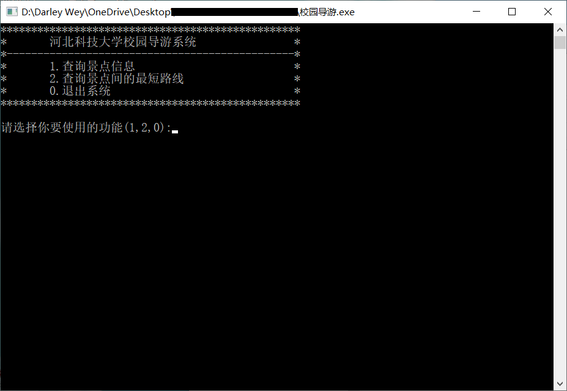

### 1.软件定位，软件的基本功能

　设计一个校园导游程序，为来访的客人提供各种信息查询服务。

​	（1）设计你所在学校的校园平面图,所含景点不少于10个。以图中顶点表示校内各景点,存放景点名称、代号、简介等信息;以边表示路径,存放路径长度等相关信息。

​	（2）为来访客人提供图中任意景点相关信息的查询。	

​	（3）为来访客人提供图中任意景点的问路查询,即查询任意两个景点之间的一条最短的简单路径。

### 2.运行代码的方法

​	（1）本程序源代码文件在visual studio code内编辑，在学校机房visual c++ 6.0下编译通过并运行，但vc6.0自带Windows控制台运行器无法输入中文，在windows10系统下直接运行已编译生成的exe文件，正常运行可输入中文。

​	（2）双击exe文件后若进入主程序失败请参见后面常见问题说明部分第一条。

​	（3）双击exe文件进入程序主程序后需准确输入命令，正常运行如图所示。

+ 主程序主菜单(输入1或2或0)

  
  
  
  
+ 功能2（准确输入景点名称）

  

  

+ 功能2结果

  


### 3.简要的说明
　　景点和旅游线路可以构成图状结构，景点作为图的顶点，旅游线路作为图的边，边上的权值作为景点间的距离，景点布局如下图所示。查询景点信息就是输出相应顶点的信息；给出到景点的最佳路线就是求最短路径问题，使用迪杰斯特拉算法即可求出最短路径。


　　创建一个无向图，针对游客的需求，将校园的景点编号、名称、介绍等信息放入到图的顶点中并保存景点文本文件DataType.txt中，将景点间的距离当权值保存在二维数组中，利用迪杰斯特拉算法来求从一个景点到另一个景点的最短距离，利用QueryVex()函数查找景点信息；在显示屏上输出相关结果，最后按照显示屏上的提示进行相关的操作。

　　创建图的过程是从文件中读入数据写到图结构的过程，另外为了方便计算最短路径，用了一个矩阵来存储各条边上的权值。

### 4.代码目录结构说明，主要函数的作用
#### （1）数据结构

```cpp
#define MAXVEX 50        //最大顶点个数
#define MAXWEIGHT 5000   //最大权值

typedef struct {
    int no;         //景点编号
    char name[20];  //景点名称
    char desc[100]; //景点简介
} VexType;         //景点结构体
typedef int weight; //权值
typedef struct {
    weight arcs[MAXVEX][MAXVEX]; //邻接矩阵
    VexType vex[MAXVEX];       //顶点信息
    int vexNum;                    //顶点数
} MGraph, * AdjMatrix;
```
#### （2）操作实现

- 根据景点名称查询景点信息
```cpp
void queryVexDesc(AdjMatrix graph, char name[]) {
    int i;
    for (i = 0; i < graph->vexNum; i++) {
        if (!strcmp(name, graph->vex[i].name)) {
            system("cls");    //清屏
            printf("景点编号：[%d],景点名称：%s\n简介：\n------\n%s\n\n", graph->vex[i].no, graph->vex[i].name, graph->vex[i].desc);
            return;
        }
    }
    printf("输入错误，请检查后重新操作\n\n");
}

```
- 根据景点名称查找景点序号
```cpp
int queryVexNo(AdjMatrix graph, char name[]) {
    int i;
    for (i = 0; i < graph->vexNum; i++)
        if (!strcmp(name, graph->vex[i].name))
            return i;
    return -1;
}
```
- 迪杰斯特拉算法求最短路径
```cpp
void dijkstra(AdjMatrix graph, int v, int dis[], int path[]) {
    int vset[MAXVEX];
    int MinDis, i, j, w;
    for (i = 0; i < graph->vexNum; i++) {
        vset[i] = 1;
        dis[i] = graph->arcs[v][i];
        if (graph->arcs[v][i] < MAXWEIGHT)
            path[i] = v;
        else
            path[i] = -1;
    }
    vset[v] = 0;
    path[v] = 0;
    for (i = 1; i < graph->vexNum; i++) {
        MinDis = MAXWEIGHT;
        for (j = 0; j < graph->vexNum; j++)
            if (vset[j] && dis[j] < MinDis) {
                w = j;
                MinDis = dis[j];
            }
        if (MinDis == MAXWEIGHT)
            return;
        vset[w] = 0;
        for (j = 0; j < graph->vexNum; j++) {
            if (vset[j] && graph->arcs[w][j] < MAXWEIGHT && dis[w] + graph->arcs[w][j] < dis[j]) {
                dis[j] = dis[w] + graph->arcs[w][j];
                path[j] = w;
            }
        }
    }
}
```
- 显示最短路径
```cpp
void dispPath(AdjMatrix graph, int path[], int dis[], int start, int end) {
    int top = -1;
    VexType base[MAXVEX];
    int pos;
    VexType vex;
    pos = path[end];
    while (pos != start) {
        base[++top] = graph->vex[pos];
        pos = path[pos];
    }
    base[++top] = graph->vex[start];
    printf("从[%s]到[%s]的最佳路径为：", graph->vex[start].name, graph->vex[end].name);
    while (top != -1) {
        vex = base[top--];
        printf("%s->", vex.name);
    }
    printf("%s", graph->vex[end].name);
    printf("\n此路径长为%d米,大约需要走%d分钟\n\n", dis[end], dis[end] / 60);
}
```

### 5.常见问题说明

​	（1）运行前应检查exe文件同级目录下是否存在程序的输入文件DataType.txt，若不存在运行后将出现如下情况无法正常进入主程序。若丢失DataType.txt文件，可编辑源代码文件使用内部已有的景点信息，解除相应注释并注释掉使用外部文件的相关代码后重新编译即可正常运行。


​	（2）请严格按照提示信息进行命令输入，不符合格式要求或输入错误会提示输入错误并返回主程序，需要重新操作。功能2中目的景点不能与出发景点相同，否则亦会提示输入错误并返回主程序。